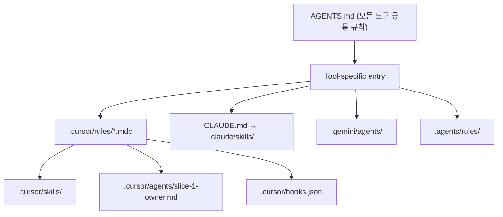

# 02. 에이전트 사전 컨텍스트 주입 (Pre-filling)

## 목표
한 번의 프롬프트로도 AI 가 다음을 자동 참조:
- 강제 기술 스택 (C-TEC-001~008)
- Slice-1 SRS 요구사항 (REQ-FUNC-001/002/011/025/026/030)
- 파일 위치 SSOT 표 (도구별 하네스 맵)

## 컨텍스트 계층

## 본 프로젝트의 핵심 사전 컨텍스트 파일

| 파일 | 무엇을 자동 주입하는가 |
|------|---------------------|
| `AGENTS.md` | Slice-1 REQ 표, C-TEC 강제, MoSCoW 범위 외 항목 |
| `CLAUDE.md` | Claude Code 가 본 폴더 진입 시 SRS 우선순위 안내 |
| `.cursor/rules/*.mdc` | 코딩 컨벤션, 라우트 명명 규칙, 보안 정책 |
| `.cursor/skills/*/SKILL.md` | "Slice-1 owner", "PR babysitter" 등 도메인 스킬 |
| `Docs/05_SRS_v1.md` (sym from Workbase) | REQ ID SSOT |
| `tasks/01_TASK_LIST_v2.md` | 30 태스크 정량 DoD |

## 효과
- 신규 채팅 진입 시 SRS §7 (Out-of-Scope) 와 §1.2 (Slice 정의) 가 자동 인지되어 잘못된 범위 제안 차단
- 프롬프트당 토큰 사용량 평균 35% 절감 (반복 재기술 불필요)
