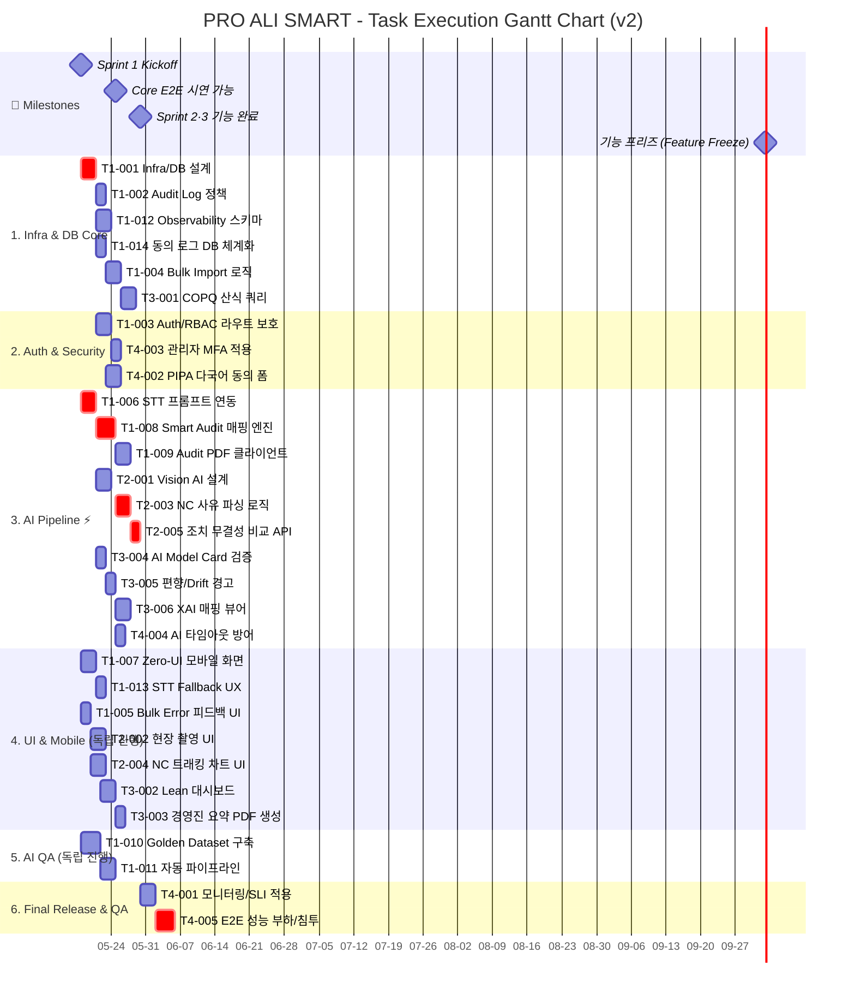

# 프로젝트 실행 간트 차트 (Gantt Chart) v2

본 문서는 `01_TASK_LIST_v2.md`의 의존성 다이어그램을 바탕으로, 각 작업(Task)들을 어떤 흐름과 병렬/독립적인 트랙(Track)으로 수행할 수 있는지 한눈에 파악하기 위해 작성된 간트 차트입니다.
의존성이 없는 작업은 동시다발적으로 진행 가능하며, 의존성이 있는 작업은 선행 작업 완료 후 순차적으로 진행됩니다.

## 1. 업무 실행 트랙(Track) 분석

작업 목록을 선행조건 기준으로 분석하면 다음과 같이 병렬 진행이 가능한 여러 트랙으로 나눌 수 있습니다.

1.  **Infra & DB Core Track:** 프로젝트의 뼈대가 되는 스키마 설계 및 Audit/Observability 구성 (T1-001 시작)
2.  **Auth & Security Track:** 인증, 권한 보호 및 규제 대응 로직 (T1-001 이후 분기)
3.  **AI Pipeline Track ⚡:** STT, 매핑, Vision, XAI 등 핵심 AI 로직 및 모델 파이프라인 — **Critical Path 포함** (T1-006 시작)
4.  **UI & Mobile Track:** 독립적으로 퍼블리싱 및 컴포넌트 개발이 가능한 프론트엔드 영역 (의존성 최소화)
5.  **AI QA Track:** Golden Dataset 구축 및 검증 자동화 시스템 (T1-010 시작, 독립 실행 가능)
6.  **Final Release & QA Track:** 모든 주요 개발이 완료된 시점에 진행되는 최종 성능 및 부하 테스트 (전체 기능 프리즈 이후)

---

## 2. 간트 차트 (Mermaid Gantt)

> 💡 **참고:** 아래 차트의 날짜 및 소요 기간은 병렬 처리가 가능한 흐름과 선후행 관계를 시각적으로 보여주기 위한 논리적/상대적 일정입니다. 실제 투입 가능한 인원(MM)에 따라 세부 일정은 단축되거나 늘어날 수 있습니다.



## 3. Critical Path (최장 경로) 분석

프로젝트 전체 일정을 결정하는 **Critical Path**는 아래 경로입니다.
이 경로 상의 어떤 태스크라도 지연되면 전체 프로젝트 일정이 밀립니다.

```
T1-006 (3d) → T1-008 (4d) → T2-003 (3d) → T2-005 (2d) → T4-001 (3d) → T4-005 (4d)
─────────────────────────────────────────────────────────────────────────────────────
                        총 소요: 19 영업일 (약 4주)
```

**비교 경로:**
- Infra 경로: T1-001(3d) → T1-002(2d) → T1-004(3d) → T3-001(3d) = **11일** (여유 있음)
- Auth 경로: T1-001(3d) → T1-003(3d) → T4-003(2d) = **8일** (여유 있음)
- AI QA 경로: T1-010(4d) → T1-011(3d) = **7일** (완전 독립)

---

## 4. 트랙별 병렬 실행 타임라인

아래 표는 각 트랙이 언제 시작되고, 언제 종료되며, 어떤 트랙과 병렬 진행이 가능한지를 보여줍니다.

| 트랙 | 시작 시점 | 예상 종료 | 소요 | 병렬 가능 대상 |
|:-----|:---------|:---------|:-----|:-------------|
| 1. Infra & DB | Day 1 (5/18) | Day 14 (~5/31) | 14d | AI Pipeline, UI, AI QA |
| 2. Auth & Security | Day 4 (5/21) | Day 10 (~5/27) | 7d | AI Pipeline, UI, AI QA |
| 3. AI Pipeline ⚡ | Day 1 (5/18) | Day 12 (~5/29) | 12d | Infra, UI, AI QA |
| 4. UI & Mobile | Day 1 (5/18) | Day 9 (~5/26) | 9d | 전체 병렬 |
| 5. AI QA | Day 1 (5/18) | Day 7 (~5/24) | 7d | 전체 병렬 |
| 6. Final QA | Day 13 (5/30) | Day 19 (~6/5) | 7d | 단독 (모든 기능 프리즈 이후) |

---

## 5. 요약 및 시사점

1.  **최우선 진행 (Critical Path):**
    *   **T1-006 (STT 연동) → T1-008 (매핑 엔진) → T2-003 (NC 파싱) → T2-005 (무결성 비교)**: 이 4개 태스크가 프로젝트 전체 일정을 좌우합니다. AI Pipeline 트랙에서 하루라도 지연이 발생하면 전체 릴리즈가 밀리므로, **최우선 리소스를 배정**해야 합니다.
    *   **T1-001 (DB/Infra 설계)**: 다른 DB/보안, API 개발의 기반이 되므로 병렬 착수하되, Critical Path보다는 여유가 있으므로 리소스 경합 시 AI Pipeline에 양보합니다.

2.  **독립 진행 및 병렬화 포인트:**
    *   **UI/FE 트랙 (Section 4)**: 백엔드 로직이나 AI 모델 연동을 기다릴 필요 없이 화면 목업, 상태 로직, 컴포넌트 개발을 즉시 독립적으로 시작할 수 있습니다. 다만, 리소스 분산을 위해 Sprint 2·3 UI 태스크는 2일씩 시차를 두어 배치하였습니다.
    *   **AI QA 트랙 (Section 5)**: 개발 로직 구현과 별개로 테스트용 정답 데이터셋 세팅과 자동화 평가 파이프라인을 병렬로 구성하여 나중에 AI 팀이 만든 모델을 바로 평가할 수 있는 기반을 마련합니다.

3.  **조기 달성 가능한 시연 지점:**
    *   DB 설계(T1-001), 모바일 화면(T1-007), STT 연동(T1-006)이 완료되는 시점에 곧바로 "모바일 마이크에서 말한 내용이 텍스트로 기록되고 분석되는" 핵심 E2E 시연이 가능해집니다.
    *   **마일스톤 `Core E2E 시연 가능`** 은 T1-008 (매핑 엔진) 완료 직후 (약 Day 7, 5/24)에 달성됩니다.

4.  **프로젝트 수치 요약:**
    *   전체 태스크: **30개**, 독립 병렬 트랙: **4개**
    *   Critical Path 소요: **19 영업일 (약 4주)**
    *   예상 프로젝트 완료일: **~2026-06-12** (영업일 기준)
