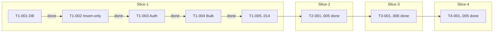

# SRS REQ-* ↔ 구현 추적성 매트릭스 (자동 생성 시드)

> 본 문서는 makersround-backend 워크플로우 가이드 6단계(QA & Traceability)의 산출물입니다.
> 모든 PR/이슈에 REQ-ID 가 명시되며, 본 표는 SRS `Docs/05_SRS_v1.md` 와 코드/테스트 자산을
> 양방향으로 매핑합니다.

| REQ-ID | 설명 | 구현 파일 / 라우트 | 검증 자산 |
|--------|------|------------------|----------|
| REQ-FUNC-001 | Audit 리포트 PDF 일괄 생성 | [src/app/dashboard/audit/sessions/[id]/page.tsx](src/app/dashboard/audit/sessions/[id]/page.tsx) (window.print + 인쇄 스타일) | 수동 시연 (T1-009) |
| REQ-FUNC-002 | 원청 양식 매핑 엔진 | [src/lib/audit/mapping-engine.ts](src/lib/audit/mapping-engine.ts), [src/app/api/v1/audit/map/route.ts](src/app/api/v1/audit/map/route.ts) | `npm run test:mapping` |
| REQ-FUNC-006~009 | NC 시정/무결성 비교 | [src/app/api/v1/nc/cases/route.ts](src/app/api/v1/nc/cases/route.ts), [src/app/api/v1/nc/cases/[id]/integrity-check/route.ts](src/app/api/v1/nc/cases/[id]/integrity-check/route.ts), [src/lib/integrity/hash.ts](src/lib/integrity/hash.ts) | `npm run test:integrity` |
| REQ-FUNC-011 | Zero-UI 음성 수집 (STT) | [src/app/api/v1/stt/route.ts](src/app/api/v1/stt/route.ts) + Audit 세션 entries 라우트 | T1-010 Golden Dataset |
| REQ-FUNC-019~022 | COPQ / Lean / 경영진 PDF | [src/app/api/v1/copq/analytics/route.ts](src/app/api/v1/copq/analytics/route.ts), [src/lib/copq/calculator.ts](src/lib/copq/calculator.ts), [src/app/dashboard/copq/page.tsx](src/app/dashboard/copq/page.tsx) | `npm run test:copq` |
| REQ-FUNC-024/025 | Insert-only 감사 로그 | Prisma 트리거 + audit_log 적재 (전 라우트) | Supabase migration `20260523000000_audit_log_rls.sql` |
| REQ-FUNC-026 | RBAC (Admin/User) | [src/middleware.ts](src/middleware.ts), [src/lib/auth/get-tenant.ts](src/lib/auth/get-tenant.ts) | Cypress 시나리오(예정) |
| REQ-FUNC-030 | CSV/Excel Bulk Import | [src/app/api/v1/bulk-imports/route.ts](src/app/api/v1/bulk-imports/route.ts) | `scripts/test-bulk-import.js` |
| REQ-FUNC-AI-005 | 편향/Drift 경고 | [src/lib/ai-governance/drift-detector.ts](src/lib/ai-governance/drift-detector.ts), [src/app/api/v1/ai/drift-report/route.ts](src/app/api/v1/ai/drift-report/route.ts) | `npm run test:drift` |
| REQ-FUNC-AI-008 | XAI 매핑 하이라이트 | [src/app/dashboard/audit/xai/page.tsx](src/app/dashboard/audit/xai/page.tsx) | UI 자가 시연 (≤300ms 표시) |
| REQ-NF-001 | Vercel 60s 우회 (Streaming) | [src/lib/ai/streaming.ts](src/lib/ai/streaming.ts), [src/app/api/v1/ai/stream-demo/route.ts](src/app/api/v1/ai/stream-demo/route.ts) | 수동 SSE 시연 |
| REQ-NF-COMPLIANCE | PIPA 다국어 동의 락업 | [src/components/consent/ConsentGate.tsx](src/components/consent/ConsentGate.tsx), [src/app/api/v1/consent/route.ts](src/app/api/v1/consent/route.ts) | E2E 시연 (5개 언어) |
| T4-001 SLI | 모니터링/SLO | [src/app/api/v1/health/route.ts](src/app/api/v1/health/route.ts), [src/app/api/v1/monitoring/sli/route.ts](src/app/api/v1/monitoring/sli/route.ts), [src/app/dashboard/admin/page.tsx](src/app/dashboard/admin/page.tsx) | `k6 run scripts/k6/smoke.js` |
| T4-003 MFA | 관리자 TOTP | [src/lib/auth/totp.ts](src/lib/auth/totp.ts), [src/app/api/v1/auth/mfa/route.ts](src/app/api/v1/auth/mfa/route.ts) | `npm run test:totp` |
| T4-005 Sec | E2E 부하/침투 | [scripts/k6/smoke.js](scripts/k6/smoke.js), [scripts/security-audit.mjs](scripts/security-audit.mjs) | CI 게이트 (`.github/workflows/ai-quality.yml`) |

## 진행 상태 요약 (2026-05-27 기준)

## 다음 작업

1. 잔여 OPEN 이슈(GitHub Project #2)에 본 매트릭스 기반 PR 링크 첨부 후 close.
2. 운영 배포 시 Supabase Auth 실 연동(현재 mock-cookie) — `src/middleware.ts` 의 TODO 참고.
3. AI 매핑 엔진 라이브 호출(MOCK_AI=false) 환경에서 Golden Dataset F1-Score 임계값 게이트 추가.
