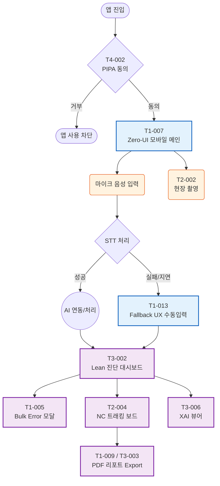

# UI PoC (Proof of Concept) 구현 전략

본 문서는 `01_TASK_LIST_v2.md` 및 `02_GANTT_CHART.md`에 정의된 **UI & Mobile 트랙**을 기반으로, 프로젝트 초기에 핵심 UX/UI의 실현 가능성을 검증(PoC)하고 구현하기 위한 세부 가이드입니다. 프론트엔드 작업은 백엔드 및 AI 파이프라인과 독립적으로 병렬 진행이 가능하므로, 최우선적으로 Mock 데이터 기반의 화면 구현과 상태 관리에 집중합니다.

## 1. UI PoC 핵심 목표

*   **Zero-UI/음성 우선 경험 검증:** 텍스트 입력 없이 현장에서 모바일 마이크와 카메라만으로 업무가 가능한지 UX 검증.
*   **Fallback 시나리오의 매끄러운 전환:** AI (STT/Vision) 실패 시 수동 입력으로 얼마나 빠르게(500ms 이내) 전환되어 유저 이탈을 방어할 수 있는지 확인.
*   **반응형 및 모바일 최우선 (Mobile-First):** 데스크톱 대시보드와 모바일 현장 입력 화면 간의 일관된 경험 및 레이아웃 최적화.

---

## 2. 주요 UI/UX 시나리오 및 태스크 매핑

### 2.1 현장 데이터 수집 (Mobile Edge)
현장 작업자가 스마트폰을 통해 Audit(심사) 및 NC(부적합) 데이터를 수집하는 과정입니다.

*   **T4-002 다국어 PIPA 동의 폼 (최초 진입):**
    *   앱 최초 실행 시 PIPA 수집 동의 화면 노출. 로컬 스토리지 확인 및 동의 거부 시 앱 사용 차단.
*   **T1-007 Zero-UI 모바일 화면:**
    *   핵심 화면: 중앙에 위치한 직관적인 '음성 인식(마이크)' 버튼.
    *   상태 표시: 대기(Idle), 듣는 중(Listening), 처리 중(Processing).
*   **T2-002 현장 촬영 UI:**
    *   카메라 API 호출 및 이미지 캡처/업로드. 4.5MB 이상 이미지 엣지 단에서 브라우저 리사이징 후 전송.
*   **T1-013 STT Fallback UX:**
    *   음성 인식 실패 또는 네트워크 지연 시 500ms 내에 수동 폼 입력 화면으로 전환.

### 2.2 대시보드 및 리포트 (Desktop/Web)
관리자 및 심사원이 수집된 데이터를 바탕으로 분석하고 피드백을 처리하는 과정입니다.

*   **T1-005 Bulk Error 피드백 UI:**
    *   대량 데이터 업로드 실패 시 원인을 시각적으로 보여주는 모달 컴포넌트(에러 발생 후 200ms 내 렌더링).
*   **T2-004 NC 트래킹 차트 UI:**
    *   부적합 사항의 진행 상태(Open, In Progress, Resolved)를 시각화하는 칸반 보드 또는 상태 프로그레스 바.
*   **T3-002 Lean 진단 및 ROI 대시보드:**
    *   복합 차트 (Recharts 또는 Chart.js 활용). 데이터 로딩 LCP 2.5초 이내 최적화. 스켈레톤 UI 적용.
*   **T1-009 / T3-003 Audit 및 경영진 요약 PDF 생성:**
    *   HTML/CSS로 구성된 뷰를 `html2pdf` 등의 클라이언트 라이브러리를 활용하여 3~5초 이내로 PDF 렌더링 및 다운로드 구현.
*   **T3-006 XAI 매핑 뷰어 UI (하이라이트):**
    *   AI가 생성한 텍스트 클릭 시, 좌측 혹은 우측의 원본 소스(PDF나 이미지 텍스트)의 해당 영역이 300ms 이내에 하이라이트 되도록 구현.

### 2.3 UI/UX 흐름도 (Flowchart)

---

## 3. UI 컴포넌트 설계 (Mock Data 활용)

프론트엔드는 백엔드 API 완료를 기다리지 않고 Mock 데이터를 활용해 독립 진행(Section 4) 합니다.

1.  **Mock API (MSW 등 활용):** STT 결과, Audit 결과, NC 리스트, 대시보드 통계 데이터 등을 JSON 형태로 하드코딩 또는 Intercept 하여 사용.
2.  **공통 컴포넌트 추출:** Button, Modal, Card, StatusBadge, ChartContainer 등 재사용 가능한 컴포넌트를 Storybook 기반으로 선행 개발.
3.  **상태 관리 (State Management):**
    *   전역 상태: 사용자 세션, PIPA 동의 여부, 테마 모드.
    *   로컬 상태: STT 진행 상태(isListening, error), 모달 토글, 폼 입력 데이터.

---

## 4. PoC 검증 기준 (Exit Criteria)

*   [ ] 데스크톱 뷰와 모바일 뷰어(개발자 도구 모바일 모드)에서 레이아웃 100% 정상 출력 확인.
*   [ ] 버튼 클릭 시 모든 UI 전환 렌더링 소요 시간이 1초(대부분 500ms) 이내로 부드럽게 작동.
*   [ ] 에러 주입 상황(Mock Error)에서 에러 바운더리 및 Fallback UI가 정상적으로 노출됨.
*   [ ] 브라우저 단에서 임시 생성된 10MB 크기 이미지 등록 시 클라이언트 리사이징 후 4.5MB 이하로 변환됨을 확인.
