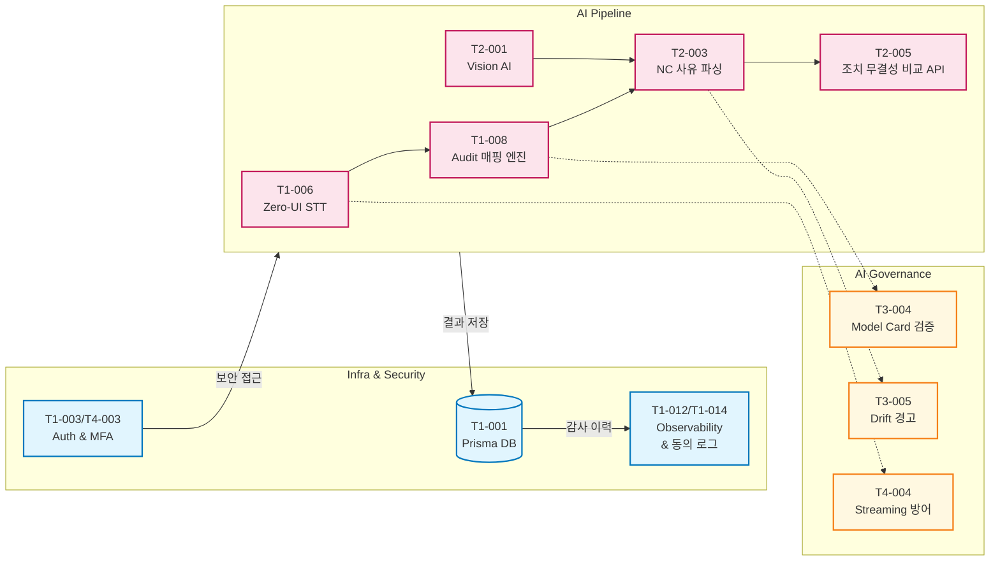

# Core & AI Implementation 전략

본 문서는 프로젝트 전체 일정의 **Critical Path**를 담당하는 **AI Pipeline 트랙**과 기반이 되는 **Infra & DB Core 트랙**에 대한 구현 상세 가이드입니다. 이 영역은 애플리케이션의 신뢰성, 성능, 그리고 법적 무결성을 결정하는 핵심 백본(Backbone) 역할을 합니다.

---

## 1. 시스템 아키텍처 핵심 요건

*   **운영 안정성 보장:** DB 스키마 검증, 에러 트래킹, 인프라 가용성 99.5% 확보.
*   **무결성 및 추적 가능성:** 모든 수정 로그는 Insert-only로 유지하며, AI 판정 로직에 대한 설명 가능성(XAI)과 무결성 보장.
*   **고가용성 AI 파이프라인:** LLM 타임아웃, 환각(Hallucination), 편향(Drift)을 시스템적으로 방어.

---

## 2. 백엔드 코어 (Infra, DB, Security) 구현 단계

기반 공사에 해당하는 작업으로, 시스템의 신뢰성과 데이터 무결성을 보장합니다.

### Phase 1: 기반 인프라 및 스키마 확립
*   **T1-001 Infra/DB 설계:** Prisma 기반 스키마 설계. 마이그레이션 스크립트 기반 CI/CD 자동화 (성공률 100%).
*   **T1-012 Observability 로그 스키마:** 비즈니스 KPI 및 에러(STT Fallback 등)를 수집할 수 있는 로그 테이블/모니터링 연동.
*   **T1-014 동의 로그 DB 체계화:** 민감 정보(PIPA) 수집 동의 이력을 해시/암호화하여 영구 보존.

### Phase 2: 보안 및 접근 제어
*   **T1-002 Insert-only Audit Log 정책:** RLS(Row Level Security)를 통한 레코드 조작 완전 차단(Admin 포함).
*   **T1-003 Auth 및 RBAC 라우트 보호:** 비인가 API 접근 차단 미들웨어.
*   **T4-003 관리자 MFA 적용:** 관리자 권한 강화를 위한 TOTP 2FA 기반 보안.

---

## 3. AI 파이프라인 (Critical Path) 구현 단계

프로젝트 성공을 좌우하는 핵심 로직으로, 엄격한 테스트(Golden Dataset)를 동반합니다.

### Phase 1: STT & Audit 매핑 (Sprint 1)
*   **T1-006 Zero-UI STT 연동:** 오디오 데이터를 텍스트로 변환. 프롬프트 엔지니어링을 통해 도메인 특화 어휘(WER 8% 이하) 최적화.
*   **T1-008 Smart Audit 매핑 엔진:** STT 결과물을 ISO 9001 템플릿의 필수 필드에 JSON 구조로 매핑. 필수값 누락 0% 목표.

### Phase 2: Vision AI & NC 로직 확장 (Sprint 2)
*   **T2-001 Vision AI 설계:** 현장 사진에서 객체를 식별하고 부적합 사항(NC) 징후를 텍스트로 추출 (정확도 90% 이상).
*   **T2-003 NC 사유 파싱 로직:** Audit 텍스트 및 Vision AI 결과물을 융합하여 부적합 사유와 시정 조치 초안 생성.
*   **T2-005 조치 전/후 무결성 비교 API:** 시정 전 데이터와 시정 후 데이터의 해시값을 비교하여 데이터 변조를 탐지.

### Phase 3: AI 거버넌스 및 모니터링 (Sprint 3 & 4)
*   **T3-004 AI Model Card 메타데이터 검증:** 사용 중인 모델의 버전, 성능 지표 서명을 CI에서 자동 검증하여 임의 배포 방지.
*   **T3-005 편향/Drift 경고 시스템:** AI 판정 결과의 편향을 분석하여 오차 발생 시 관리자에게 알림.
*   **T4-004 AI Streaming 타임아웃 방어:** 60초 이상의 대규모 추론 시 Vercel Edge Runtime을 활용한 스트리밍 응답 설계로 Gateway Timeout 방지.

### 3.1 AI 파이프라인 아키텍처 (Architecture)

---

## 4. AI QA 및 평가 전략 (독립 병렬 트랙)

개발 로직과 분리하여, 객관적이고 자동화된 모델 성능 평가 파이프라인을 구축합니다.

*   **T1-010 Golden Dataset 구축:** STT 100건, 매핑 50건 이상의 정답지 JSON 데이터셋 확립.
*   **T1-011 AI 품질 검증 파이프라인:** GitHub Actions 연동. 프롬프트/모델 수정 후 PR 발생 시, Golden Dataset으로 F1-Score를 자동 산출하여 회귀(Regression) 여부 확인.

---

## 5. 실행 체크리스트 (Exit Criteria)

*   [ ] 모든 DB 쿼리(Update/Delete 우회 시도)는 RLS 정책에 의해 차단되며 에러 로그를 남김.
*   [ ] Golden Dataset 100건 테스트 시 AI 모델 응답 성공률(정확한 JSON 스키마 반환)이 99% 이상임.
*   [ ] AI 타임아웃 테스트 (고의 지연 주입) 시 504 에러 없이 청크 단위로 스트리밍이 정상 수신됨.
*   [ ] 시스템 주요 모니터링 (가용성, 에러율, STT Fallback율) 지표가 CloudWatch (또는 유사 솔루션)에 1초 이내 적재됨.
